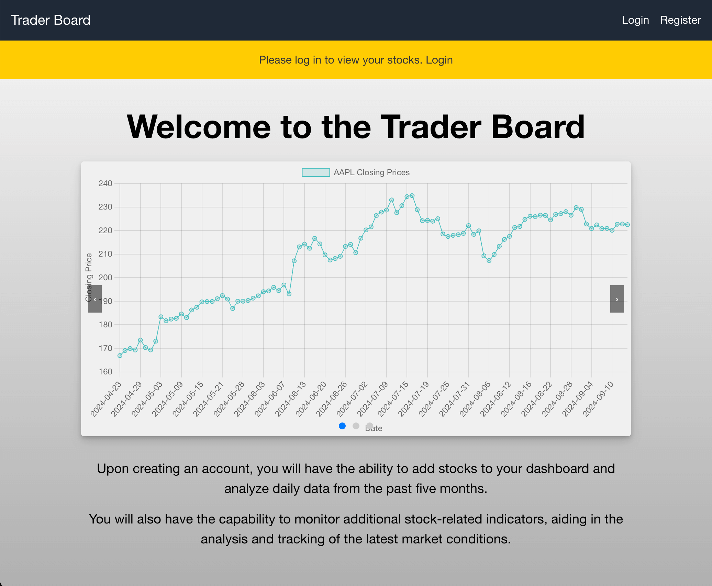
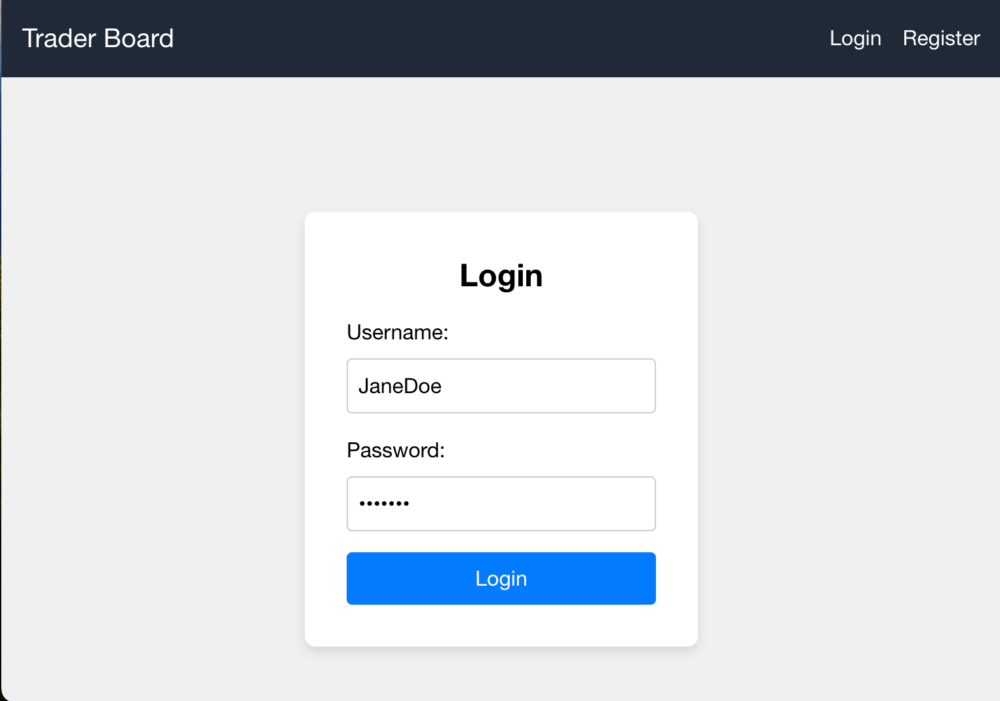
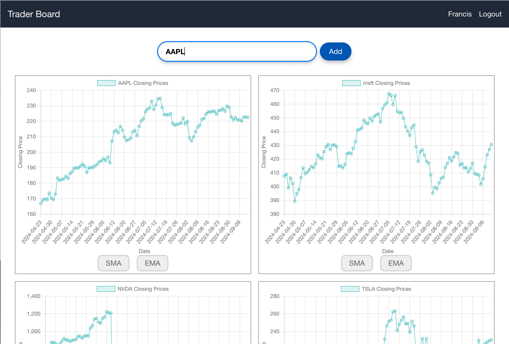
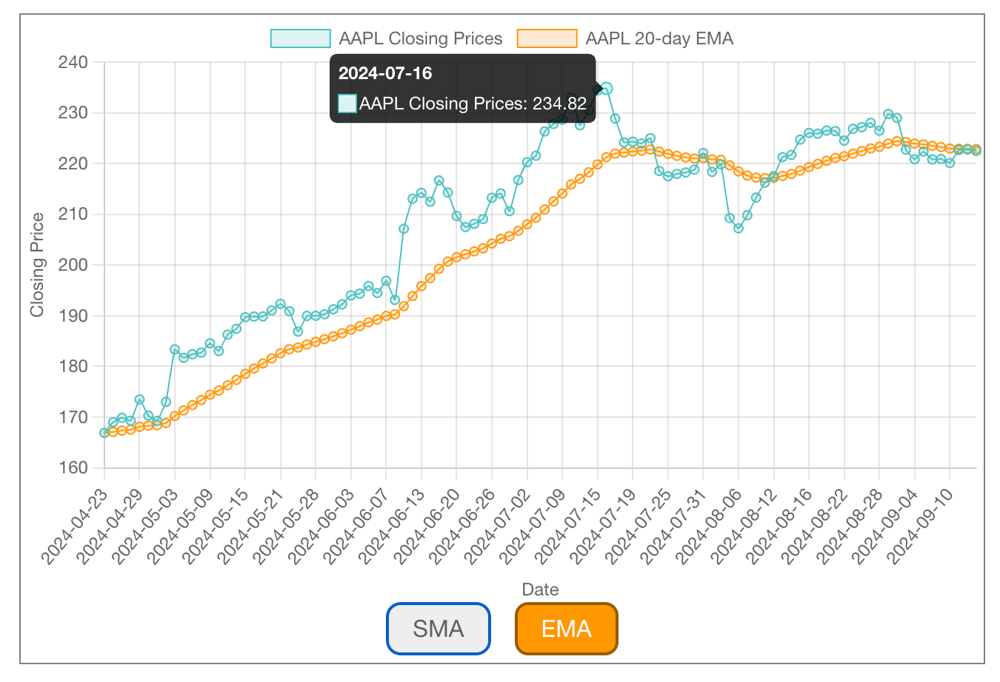
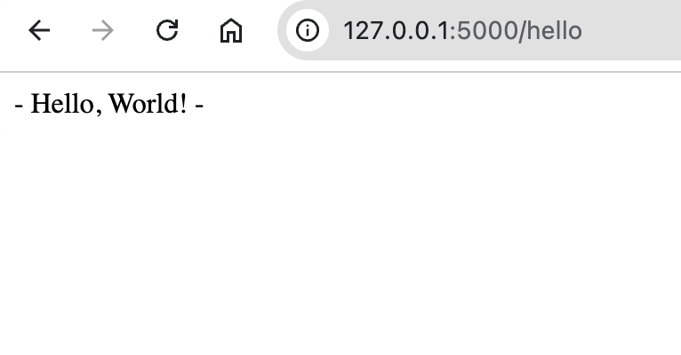

# Trader board

This is an Python Flask + React app. The database uses lightweight Sqlite3. When building a real app, should consider replacing it with
PostgreSQL.

### This is merely a simple demo program; many features are yet to be finished.

## Overview:

### 1. Unlogin Landing page:
  

### 2. Login page (Register is similar)
  
  First time users need to register first, then login again.

### 3. User dashboad
  After login, the User dashboad will display by defalut, where users can add Stock by entering the stock symbol on the top input bar.
  

### 4. Check indicator
  After a stock successfully added, users can also check some indicator directly on the Stock daily record chart.
  

## Caveat
  Since the app is using free API key from Alpha Vantage, limitation is expected.
  So far, Alpha Vantage only provides 25 requests per day to users with free API KEY, so you may need to switch to different API keys and connect to different wifi (so that the IP of the flask server changed)

## How to Run:

### Backend

Make sure you have `poetry` installed, then enter the 'backend' directory.

1. `poetry config virtualenvs.in-project true`
This let poetry know that you would like to create '.venv' under 'trader-board/backend/' instead of some where in your system directory.

2. `poetry install`
Install all the dependencies for the flask app

3. `poetry run flask-run`
This will start the flask server, you shoudld be able to see these information in the terminal:
```
 * Serving Flask app 'backend:create_app'
 * Debug mode: on
WARNING: This is a development server. Do not use it in a production deployment. Use a production WSGI server instead.
 * Running on http://127.0.0.1:5000
```
To test if the server is working, open 'http://127.0.0.1:5000/hello' in the browser, you should see a '- Hello, World! -' response:


4. Open a tab in the terminal, then run `source .venv/bin/activate`

5. `poetry run flask-init-db`
This will initialize the database for the flask app

### Frontend

Enter the 'frontend' directory

1. `npm install`

2. `npm start`


## Developement Detail:

### Backend: 

Basic code structure:
```
.
├── backend
│   ├── __init__.py
│   ├── api
│   │   ├── auth.py
│   │   ├── stock.py
│   │   └── utils
│   │       └── exceptions.py
│   ├── contanst.py
│   ├── data_fetcher.py
│   ├── db.py
│   ├── indicators.py
│   └── schema.sql
├── env.json
```

  - `env.json`: Currently contain the free tier AlphaVantage API key, you could replace it with your key.

  - `schema.sql`: Database design for the serevr.

  - `__init__.py`: Main app entry, sort out app config, register api blueprint ect.

  - `db.py`: Database utils

  - `api/`: Contain all the api blueprint, including register, login, add stock and so on.

  - `data_fetcher.py`: Fetch data from AlphaVantage services.

### Frontend:

Basic code structure:
```
.
├── App.css
├── App.tsx
├── components
│   ├── add-stock-input
│   ├── carousels
│   ├── default-landing-page
│   │   ├── ...
│   │   └── index.tsx
│   ├── header
│   ├── loading-skeleton
│   ├── stock-graph
│   └── user-dashboard
├── index.tsx
├── pages
│   ├── home
│   ├── login
│   └── register
├── service
│   ├── api.tsx
│   └── interface.ts
```
 - `App.tsx`: App entry, where with FE router defined (with react-router), also fetch user info to check login status

 - `pages/`: Contains all pages defined in the FE router. Depending on the login status, the home page will display the default-landing-page or the user-dashboard

 - `components/`: All the custom React components that build for FE app.
 
 - `service/`: Contains API fetcher, interface and type definition. All the api request is made with react-query.
